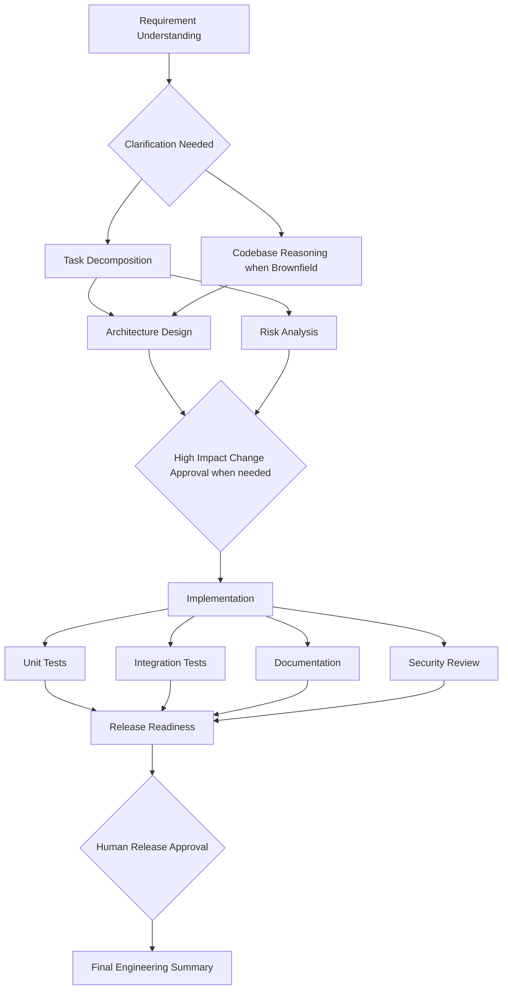

# Agentic URL Shortener

A URL shortening service with analytics and a governed, stateful software engineering orchestration layer. The project demonstrates requirement analysis, task decomposition, dependency driven execution, validation, human approvals, auditability, reliability controls, and dynamic replanning across the software development lifecycle.

## Features

### URL service

* URL creation with generated or custom aliases
* Optional expiration
* Redirects with click tracking
* Privacy conscious analytics without storing raw IP addresses
* URL disable support
* Input validation and safety checks
* Bounded alias collision retries
* Basic rate limiting
* Health endpoints

### Engineering orchestration

* Explicit dependency graph
* Sequential and parallel execution paths
* Synchronization gates
* Cross stage context and decision lineage
* Human clarification, high impact change, and release approval checkpoints
* Bounded retries with exponential delay
* Fallback execution paths
* Artifact rollback for failed mutating stages
* Safe stop behavior
* Security and change control policy checks
* Persistent workflow state
* Audit events and traceability
* Reliability metrics including success rate, retries, rollbacks, MTTR, and end to end latency
* Dynamic replanning when requirements change
* Greenfield, brownfield, and ambiguous requirement scenarios

## Architecture



The workflow runtime uses deterministic local agent implementations so execution remains reproducible and does not depend on external services. Agent contracts are isolated behind small interfaces, which allows alternate implementations to be integrated without changing dependency management, approval gates, policies, retries, rollback behavior, or audit controls.

## Quick start

### Local Python

```bash
python -m venv .venv
source .venv/bin/activate
pip install -e ".[dev]"
pytest
uvicorn urlshortener.main:app --reload
```

On Windows PowerShell:

```powershell
.venv\Scripts\Activate.ps1
```

Open the API documentation at `http://localhost:8000/docs`.

### Docker

```bash
docker compose up --build
```

## URL API examples

Create a short URL:

```bash
curl -X POST http://localhost:8000/api/v1/urls \
  -H "Content-Type: application/json" \
  -d '{"url":"https://example.com/docs","custom_alias":"docs123","expires_in_days":30}'
```

Resolve it:

```bash
curl -i http://localhost:8000/docs123
```

Read analytics:

```bash
curl http://localhost:8000/api/v1/urls/docs123/analytics
```

## Engineering workflow API

Start a greenfield workflow:

```bash
curl -X POST http://localhost:8000/api/v1/engineering/runs \
  -H "Content-Type: application/json" \
  -d '{"requirement":"Add URL expiration support with tests and documentation","scenario_type":"greenfield"}'
```

The workflow executes until it reaches a required human approval gate. Ambiguous requirements stop at `clarification_gate`. Every workflow requires `release_approval` before final completion.

Approve a release gate:

```bash
curl -X POST http://localhost:8000/api/v1/engineering/runs/RUN_ID/approvals/release_approval \
  -H "Content-Type: application/json" \
  -d '{"approved":true,"reviewer":"Karthik","note":"Reviewed release evidence"}'
```

Replan after a requirement change:

```bash
curl -X POST http://localhost:8000/api/v1/engineering/runs/RUN_ID/replan \
  -H "Content-Type: application/json" \
  -d '{"changed_requirement":"Add expiration and remaining lifetime to URL details","reason":"Product requirement changed after design review"}'
```

Read reliability metrics:

```bash
curl http://localhost:8000/api/v1/engineering/metrics
```

## Scenario demonstrations

Run the three workflow scenarios:

```bash
python scripts/run_scenarios.py
```

This executes greenfield, brownfield, and ambiguous requirement workflows and writes their audit traces to `artifacts/demos/`.

## Testing and quality

```bash
pytest --cov=urlshortener --cov-report=term-missing
ruff check src tests scripts
```

GitHub Actions runs linting and tests on Python 3.11 and Python 3.12.

## Repository structure

```text
src/urlshortener/
  main.py                 HTTP transport and endpoints
  service.py              URL domain service
  models.py               Persistence entities
  security.py             URL and analytics safety helpers
  rate_limit.py           Prototype abuse control
  orchestration/
    graph.py               Dependency graph and execution conditions
    agents.py              Stage agents and fallback implementations
    orchestrator.py        Scheduler, gates, retries, rollback, and replanning
    policies.py            Output guardrails
    store.py               Persistent workflow state
    workflow_models.py     Run, audit, approval, and decision models
scenarios/                 Greenfield, brownfield, and ambiguous scenarios
scripts/run_scenarios.py   Scenario execution utility
artifacts/demos/           Generated workflow traces
docs/                      Architecture, ADRs, scenarios, testing, and traceability
tests/                     Unit and integration tests
.github/workflows/ci.yml   Continuous integration quality gate
```

## Design decisions

1. URL domain logic is independent of the web framework so it can be tested directly.
2. Workflow state is separated from application data so engineering governance concerns remain isolated.
3. Independent workflow nodes execute concurrently while dependency checks provide explicit synchronization.
4. Human approval gates are represented as first class workflow nodes.
5. Retries are bounded, fallback behavior is explicit, and critical policy violations safely stop execution.
6. Replanning invalidates affected downstream work and requires fresh validation and approval.
7. Local SQLite persistence and process local rate limiting are intentionally simple runtime choices. Scalable production alternatives are documented separately.

## Documentation

Detailed engineering documentation is available in the `docs` directory:

1. `docs/requirements_traceability.md`
2. `docs/architecture.md`
3. `docs/scenarios.md`
4. `docs/testing.md`
5. `docs/final_engineering_summary.md`
6. `docs/adr/`

## License

No open source license is included. All rights are reserved unless a license is added later.
