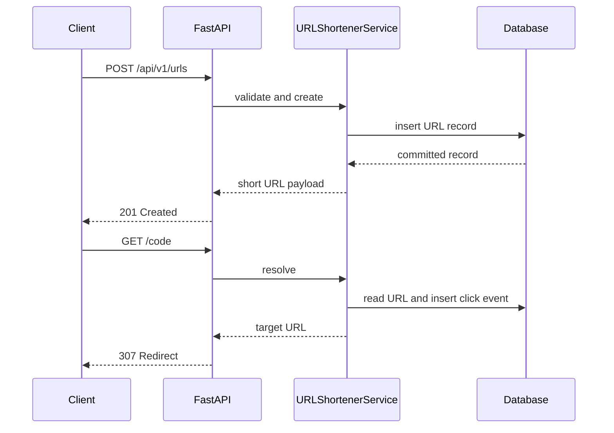

# Architecture Overview

## System boundaries

The prototype contains two related systems.

The first is the customer facing URL shortener. FastAPI handles transport, `URLShortenerService` owns domain behavior, SQLAlchemy owns persistence, and SQLite is the default local data store.

The second is the engineering control plane. It accepts a software requirement and moves it through a dependency graph of specialized agents. The graph is stateful, auditable, restartable from persisted state, and intentionally constrained by approvals and policies.

## Orchestration model

The graph is defined in `orchestration/graph.py`. Dependencies are data, not implicit call ordering. A node can run only when every dependency is successful or intentionally skipped.

Parallelism is visible in two places. Architecture design and risk analysis become ready after decomposition. After implementation, unit testing, integration testing, documentation, and security review become ready together. The scheduler executes each ready batch concurrently and synchronizes at release readiness.

## Entry and exit gates

Each node has an entry gate based on dependency completion, optional scenario condition, and optional human approval.

Each agent result passes an exit contract in `_validate_result`. The contract checks required output fields and stage specific expectations. Policy scanning runs before the artifact is accepted.

## Controlled autonomy

Agents can execute multi step work inside their domain, but the orchestrator controls when they run and what happens after failure.

Autonomy boundaries are:

* Bounded attempt counts per node
* Explicit fallback agent names
* Snapshot based artifact rollback for mutating nodes
* Critical policy findings trigger safe stop
* Ambiguous requirements can require a clarification gate
* High impact changes require preimplementation approval
* Every release requires human approval
* Replanning invalidates downstream decisions and approvals

## State and lineage

`WorkflowRun` stores artifacts, node statuses, approvals, audit events, decisions, plan version, retry and rollback counts, and failure recovery timestamps.

Decisions carry parent decision identifiers. This provides a lightweight lineage chain that shows which earlier decisions informed a later decision.

The JSON state store uses write to temporary file followed by atomic replacement. This is adequate for one process. A production version would use transactional shared storage with optimistic concurrency.

## Policy guardrails

The output policy checks for likely secret material and a small set of dangerous implementation patterns. It demonstrates where enterprise security and compliance policy enforcement belongs in the control plane.

A production implementation would extend this point with organization policy as code, dependency scanning, SAST, SBOM generation, data classification, and change ticket validation.

## Reliability controls

The orchestrator records:

* Run success rate
* Retry count and retry frequency
* Rollback count and rollback frequency
* Mean end to end latency
* Mean time to recovery when a failed attempt later succeeds

A transient failure can be injected in the implementation stage with workflow metadata to demonstrate bounded retry behavior.

## Dynamic replanning

`replan` accepts a changed requirement and reason. It increments the plan version, invalidates requirement understanding and every descendant, clears stale downstream artifacts and approvals, records an audit event, then resumes execution through the same governed graph.

This avoids the common agentic failure mode where an upstream decision changes but downstream artifacts are silently treated as valid.

## URL shortener data flow

## Production evolution

For production scale, SQLite would be replaced by PostgreSQL or another managed relational database. Rate limiting would move to a distributed store or gateway. Workflow state would use transactional persistence and a durable queue. Audit events would be exported to centralized observability. URL abuse controls would integrate a reputation or policy service.
